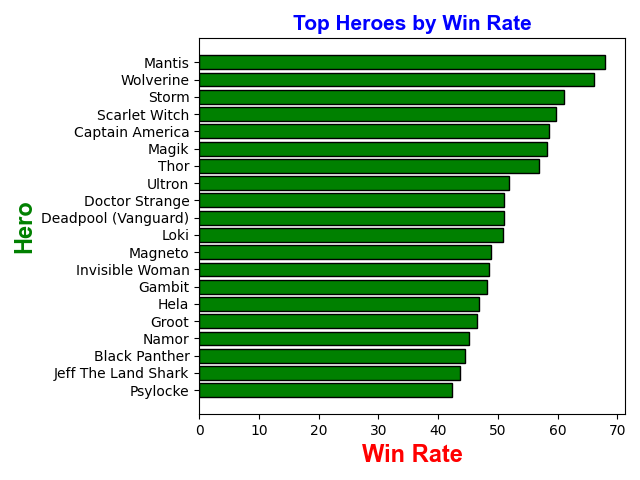
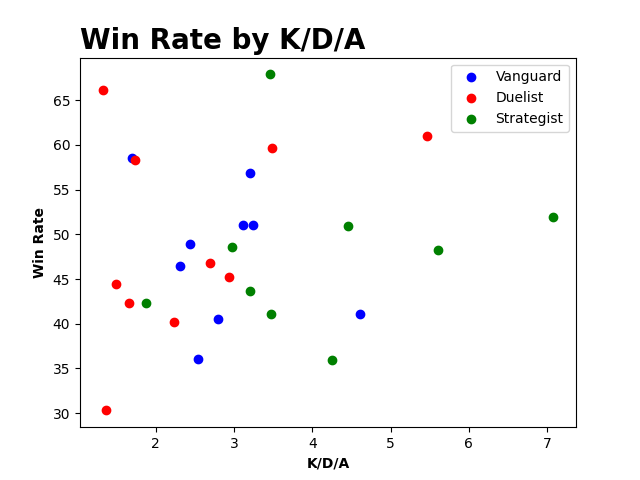
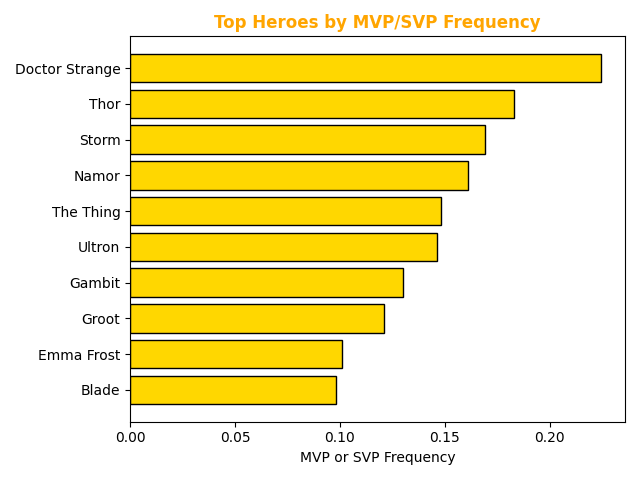

# Marvel Rivals Personal Performance Analysis
Personal match data analysis using Python, pandas, and matplotlib

## Overview
I pulled together my data from tracker.gg to see my stats for all the heroes I've played and compiled that data into a csv file. I then used pandas and matplotlib to generate useful visualizations of that data like my K/D, win rate, MVPs/SVPs for each hero and role.

## Tools & Libraries

- Python 3
- pandas
- matplotlib

## Charts

### Top Heroes by Win Rate

### K/D vs. Win Rate by Role

### MVP/SVP Frequency per Match

## Key Findings
- I'm truly surprised about the high win rate with mantis but given only a little over 33 matches I've had as her, I would hesitate to truly count it. Wolverine is also a little surprising because I have no MVPs/SVPs as him but given that I have only 17 matches as him, I would expect the win rate to be a bit higher since I usually only go Wolverine when the enemy team is solo-tanking and that usually works out despite my mediocre Wolverine performance. 
